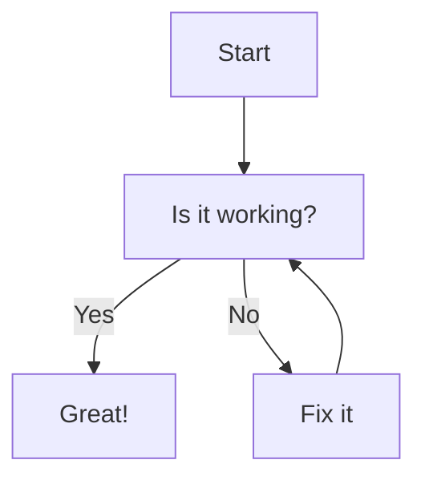

## Introduction

This is the *first* blog post. You can include **Markdown** content, code blocks, images, etc.

## Conclusion

This is a simple example of a blog post using Markdown. You can add more content, links, and other elements as needed.